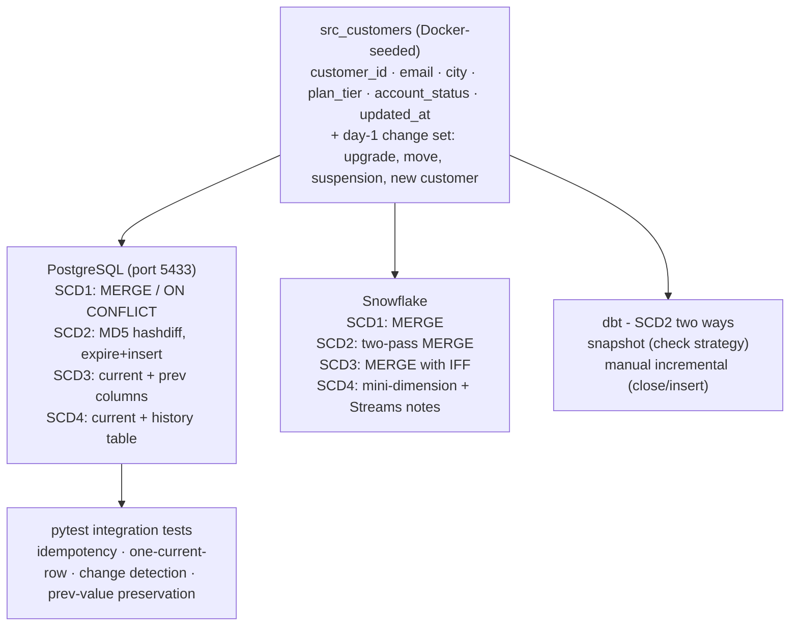

# SCD Implementation Deep-Dive - Interview Guide

> **Diagram:** see `architecture.svg` in this folder (opens in any browser).

---

## 30-second pitch

"I implemented Slowly Changing Dimensions Types 1 through 4 from scratch in both PostgreSQL and Snowflake, plus SCD2 three different ways - raw SQL, dbt snapshot, and a manual dbt incremental model - to understand the real trade-offs instead of just memorizing definitions. Along the way I benchmarked MERGE vs delete+insert with Snowflake's Query Profile, used MD5 hashdiffs for change detection, handled late-arriving records and soft deletes, and wrote pytest integration tests that prove idempotency and the one-current-row invariant."

---

## Architecture walkthrough (2–3 min)

**The lab setup:** a `src_customers` table seeded by Docker, plus a `src_customers_day1` snapshot simulating realistic changes - alice upgrades her plan, bob moves city, dave gets suspended, frank signs up. Each SCD script is run against initial load, then the day-1 changes, then re-run to prove idempotency.

**What each type does (quick recall):**

| Type | Behavior | Use when |
|------|----------|----------|
| SCD1 | Overwrite, no history | Corrections; attribute history doesn't matter |
| SCD2 | New row per change, valid_from/to + is_current | Point-in-time analysis (the workhorse) |
| SCD3 | Keep previous value in a `prev_` column | Only "before vs after" of one transition matters |
| SCD4 | Current table + separate history table | Fast current lookups + full audit history |

---

## Key technical points (and the "why")

**MD5 hashdiff for change detection.**
Instead of `WHERE t.email != s.email OR t.city != s.city OR ...` (N comparisons, NULL-handling pain), compute one MD5 across all tracked columns and compare hashes. The pipe separator between fields prevents boundary collisions: `'a' + '|bc'` would hash the same as `'a|' + 'bc'` without it. NULLs are coalesced to empty strings so they compare deterministically.

**SCD2 in Snowflake = two-pass MERGE.**
Pass 1 closes changed rows (sets `valid_to`, `is_current = false`); pass 2 inserts new versions. A single MERGE can't do both cleanly because the same source row needs to drive both an UPDATE on the old version and an INSERT of the new one.

**MERGE vs delete+insert - the benchmark finding.**
On large SCD2 tables, MERGE rewrites micro-partitions twice - once for the UPDATE pass, once for the INSERT. Above roughly 100M rows, delete+insert as two separate statements writes fewer micro-partitions. I verified this in Query Profile by comparing TableScan counts and partition write stats. Takeaway: MERGE is cleaner and transactional; delete+insert wins on big tables if you can manage the transactional boundary.

**dbt snapshot vs manual incremental SCD2.**
Snapshot: hashdiff, validity windows, and `is_current` are automatic - minimal code - but history only accumulates forward from the first run; you can't backfill history before that date. Manual incremental (`models/scd2_incremental.sql`): explicit close/insert SQL, more code, but supports arbitrary backfill. Rule of thumb: snapshot by default, manual when you need to reconstruct history.

**Idempotency as a test, not a hope.**
pytest integration tests run against the Docker Postgres: re-running any SCD script with unchanged source data must produce zero new rows, and SCD2 must always have exactly one `is_current` row per customer. Also tested: change detection actually fires, and SCD3 preserves the previous value correctly.

---

## Questions interviewers ask, with answers

**"Explain SCD2 like I'm a junior engineer."**
Each version of a record is its own row with a validity window. When something changes, you close the old row (set its end date) and insert a new row that's current. You can then ask "what did this customer look like on any past date?" by filtering on the window.

**"How do you handle late-arriving records in SCD2?"**
A record arriving with an `updated_at` earlier than the current row's `valid_from` can't just be appended - it belongs in the middle of history. The implementation slots it in by adjusting the validity windows of neighboring rows. This is precisely the case dbt snapshot can't handle, and why I built the manual incremental variant.

**"How do you do deletes in SCD2?"**
Soft delete: don't remove the row - close the current version and mark a deletion flag (or insert a terminal row with `account_status = 'deleted'`). Hard deletes destroy the history that SCD2 exists to keep.

**"When would you pick SCD3 or SCD4 over SCD2?"**
SCD3 when the business only ever asks about one transition ("current vs previous sales territory") and table width matters more than full history. SCD4 when current-state queries dominate and must be fast - the slim current table serves lookups while the history table serves audit/analysis. SCD2 is the default when point-in-time correctness matters.

**"Why does idempotency matter so much here?"**
Orchestrators retry. If an SCD2 merge isn't idempotent, every Airflow retry mints phantom versions and duplicates current rows - corrupting exactly the history you built the dimension to protect. The hashdiff comparison is what makes re-runs no-ops: unchanged data produces no hash differences, so nothing fires.

**"What did Query Profile actually show you?"**
The MERGE plan showed two write phases against the target's micro-partitions and a higher partition-rewrite count than the delete+insert pair on the same change set. It made a textbook claim ("merge can be slower at scale") concrete and measurable.

---

## Numbers to remember

- 4 SCD types �- 2 engines (PostgreSQL + Snowflake), SCD2 implemented 3 ways
- MERGE vs delete+insert crossover: roughly the ~100M-row scale
- 5 integration test scenarios; idempotency confirmed on re-run for every type
- Day-1 change set covers: update (plan), update (city), suspension, new insert
